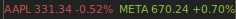

# AwesomeWM Stock Ticker

A stock ticker widget for [awesome](https://awesomewm.org) 4.x. Live quotes in
your wibar, coloured by the day's move, with a detail tooltip on hover.



Hovering a ticker shows a tooltip with its full information.

Two things make it different from the usual ticker widget:

- **Your tickers live in your `rc.lua`**, not in the widget source.
- **The data source is a plugin.** Yahoo Finance works out of the box with no
  API key. Pointing it at any other HTTP API — including authenticated ones —
  means writing two small functions, not editing the widget.

## Contents

- [Requirements](#requirements)
- [Install](#install)
- [Configuring tickers](#configuring-tickers)
- [All options](#all-options)
- [Polling and market hours](#polling-and-market-hours)
- [Built-in providers](#built-in-providers)
- [Writing your own provider](#writing-your-own-provider)
- [The quote table](#the-quote-table)
- [Authentication](#authentication)
- [Troubleshooting](#troubleshooting)

## Requirements

- awesome 4.x (developed against 4.3)
- `curl`
- `xdg-open`, only for the default click action

**No Lua dependencies.** JSON decoding is vendored in `json.lua` (decode-only,
~160 lines), so there is nothing to install with luarocks or apt.

## Install

```sh
git clone https://github.com/<you>/AwesomeWM-Stock-Ticker ~/.config/awesome/stocks
```

The directory **must** be named `stocks` for `require("stocks")` to find it, or
adjust the module name to match.

In your `rc.lua`, near the other widget requires:

```lua
local stocks_widget = require("stocks")
```

and in your wibar's right-hand widget list:

```lua
stocks_widget({ symbols = { "AAPL", "META" } }),
```

Restart awesome (`Mod4+Ctrl+r` by default). That's the whole setup — there is no
config file to create.

## Configuring tickers

Everything is passed inline where you place the widget in `rc.lua`:

```lua
stocks_widget({
    symbols   = { "AAPL", "META", "NVDA" },
    show_name = true,
}),
```

Symbols are whatever your provider understands. For Yahoo that includes non-US
listings, indices, crypto and FX:

```lua
symbols = { "AAPL", "ENI.MI", "^GSPC", "BTC-USD", "EURUSD=X" },
```

Anything you leave out falls back to the defaults in the table below.

Because configuration is per-call, several independent tickers are just several
calls:

```lua
stocks_widget({ symbols = { "AAPL", "META" } }),
stocks_widget({ symbols = { "BTC-USD" }, refresh_closed = 60 }),
```

## All options

| key | default | meaning |
|---|---|---|
| `symbols` | `{}` | tickers to display, in order |
| `provider` | `"yahoo"` | provider name, or a provider table |
| `provider_options` | `{}` | passed through to the provider |
| `api_key` | – | literal key, for providers that need one |
| `api_key_cmd` | – | shell command printing the key on stdout |
| `refresh_open` | `60` | poll seconds during regular trading |
| `refresh_extended` | `300` | poll seconds pre/post market |
| `refresh_closed` | `900` | poll seconds when the market is closed |
| `timeout` | `10` | curl timeout, seconds |
| `show_name` | `false` | prefix each quote with its symbol |
| `show_price` | `true` | show the price |
| `show_percent` | `true` | show the change percentage |
| `price_format` | `"%.2f"` | `string.format` pattern for prices |
| `percent_format` | `"%+.2f%%"` | `string.format` pattern for the change |
| `separator` | `"  "` | text between tickers |
| `font` | theme default | font for the textboxes |
| `color_up` | `#8CC63F` | colour when the day's change is positive |
| `color_down` | `#D05050` | colour when negative |
| `color_flat` | `beautiful.fg_normal` | colour when flat or unknown |
| `color_error` | `#E0A030` | colour for a failed ticker |
| `on_click` | quote page | `function(symbol, quote)`, or `false` to disable |
| `quote_url` | provider's | URL template for the default click action, `%s` = symbol |

### Mouse

- **Left click** — opens the provider's quote page (Yahoo Finance for `yahoo`)
  via `xdg-open`. Override with `quote_url`, replace with `on_click`, or
  disable with `on_click = false`.
- **Middle click** — force an immediate refresh.
- **Hover** — tooltip with full information for that ticker.

## Polling and market hours

The widget keeps **no market calendar**. Providers report a `market_state` with
each quote, and the poll interval follows it:

| state | interval |
|---|---|
| `REGULAR` | `refresh_open` (60s) |
| `PRE` / `POST` | `refresh_extended` (300s) |
| `CLOSED` | `refresh_closed` (900s) |
| `UNKNOWN` | `refresh_open` |

So nights, weekends and public holidays back off on their own, and daylight
saving is handled by whoever actually knows — the exchange. Providers that
cannot report state are polled at `refresh_open` throughout; set that
conservatively if your provider has a tight rate limit.

Requests are one per symbol per tick. Three symbols at 60s is 180 requests an
hour during market hours.

## Built-in providers

| provider | key | data |
|---|---|---|
| `yahoo` | none | price, change, previous close, day range, 52-week range, name, exchange, market state |
| `finnhub` | free | price, change, previous close, day range |

### yahoo

Default. Uses Yahoo's `v8/finance/chart` endpoint — no key, no registration.

> **This endpoint is undocumented.** It is what most open-source tickers use and
> has been stable for years, but Yahoo can and does change it without notice —
> their `v7/quote` endpoint (which allowed multi-symbol batching) started
> returning `401 Unauthorized` in 2025, which is why this widget issues one
> request per symbol. Fine for a wibar; don't build anything that matters on it.

### finnhub

[finnhub.io](https://finnhub.io), free tier 60 requests/minute. Needs an API
key. Included partly as a working second source and partly as a worked example
of the authentication path. Its `/quote` endpoint returns prices only — no
company name, no trading calendar — which demonstrates that the widget degrades
gracefully when a provider supplies less.

```lua
stocks_widget({
    symbols     = { "AAPL", "META" },
    provider    = "finnhub",
    api_key_cmd = "cat ~/.credentials/finnhub-token",
}),
```

## Writing your own provider

A provider is a Lua module in `providers/` exporting two functions. Here is a
complete one for a hypothetical authenticated JSON API:

```lua
-- providers/example.lua
local json = require("stocks.json")

local P = {
    name      = "example",
    needs_key = true,                                  -- widget errors if no key
    quote_url = "https://example.com/quote/%s",        -- for the click action
}

--- Build the HTTP request for one symbol.
-- @tparam string symbol
-- @tparam table  opts  provider_options, plus the resolved `api_key`
-- @treturn table { url = string, headers = { [name] = value } }
function P.request(symbol, opts)
    return {
        url = string.format("%s/v1/quote?symbol=%s",
                            opts.host or "https://api.example.com", symbol),
        headers = {
            Authorization = "Bearer " .. (opts.api_key or ""),
            Accept        = "application/json",
        },
    }
end

--- Turn the response body into a standardised quote.
-- @treturn table|nil quote
-- @treturn string|nil error message
function P.parse(body, symbol)
    local d, err = json.decode(body)
    if not d then return nil, "json: " .. tostring(err) end
    if d.error then return nil, tostring(d.error) end

    local price = tonumber(d.last)
    if not price then return nil, "no price in response" end

    return {
        symbol         = symbol,
        name           = d.company,
        price          = price,
        previous_close = tonumber(d.prev_close),
        change_percent = tonumber(d.change_pct),
        currency       = d.ccy,
        market_state   = d.is_open and "REGULAR" or "CLOSED",
    }
end

return P
```

Use it by name:

```lua
stocks_widget({
    symbols          = { "AAPL" },
    provider         = "example",
    provider_options = { host = "https://api.example.com" },
    api_key_cmd      = "pass show example/api-key",
}),
```

…or pass the table directly, which is handy for a one-off without adding a file:

```lua
stocks_widget({
  symbols = { "AAPL" },
  provider = {
    name = "inline",
    request = function(sym) return { url = "https://.../" .. sym } end,
    parse   = function(body, sym)
        return { symbol = sym, price = tonumber(body) }
    end,
  },
}),
```

### Rules

1. **`parse` must never raise.** Return `nil, "message"` on any problem. The
   widget wraps it in `pcall` regardless, but a clean message reaches the
   tooltip while a raised error just reads `parse error: ...`.
2. **Check for in-band errors.** Many APIs return HTTP 200 with an error in the
   body. Yahoo does; Finnhub returns all-zero prices for an unknown symbol.
3. **Only `symbol` and `price` are required.** Omit what your source doesn't
   provide — the widget adapts.
4. **`change_percent` drives the colour.** If you omit it but supply
   `previous_close`, the widget computes it.

### JSON null

`json.decode` maps JSON `null` to the sentinel `json.null`, **not** `nil`, so a
present-but-null field can be told apart from a missing one. The sentinel is a
table, so neither a truthiness check nor `type(v) == "table"` will do what you
expect:

```lua
if type(d.error) == "table" then ... end          -- WRONG: matches null
if type(d.error) == "table" and d.error ~= json.null then ... end   -- right
```

This is the single easiest mistake to make when writing a provider; the bundled
`yahoo.lua` shows the correct pattern.

If you would rather not think about it, decode with a nil-mapping wrapper:

```lua
local function denull(v) if v == json.null then return nil end return v end
```

## The quote table

Returned by `parse`, consumed by the widget. Only `symbol` and `price` are
required.

| field | type | used for |
|---|---|---|
| `symbol` | string | display, required |
| `price` | number | display, required |
| `name` | string | tooltip |
| `previous_close` | number | tooltip; derives `change_percent` if absent |
| `change` | number | tooltip |
| `change_percent` | number | **drives the up/down colour** |
| `currency` | string | tooltip |
| `exchange` | string | tooltip |
| `timezone` | string | informational |
| `day_high`, `day_low` | number | tooltip day range |
| `week52_high`, `week52_low` | number | tooltip 52-week range |
| `market_state` | string | `REGULAR`, `PRE`, `POST`, `CLOSED`, `UNKNOWN` — **drives the poll interval** |
| `trading` | table | `{ regular = { start, stop }, pre = …, post = … }`, epoch seconds |
| `timestamp` | number | tooltip "updated" time, epoch seconds |

## Authentication

Two ways to supply a key:

```lua
api_key     = "abc123",                              -- literal, in your config
api_key_cmd = "cat ~/.credentials/finnhub-token",    -- read at startup
```

`api_key_cmd` is preferred: the token stays out of your dotfiles and can live in
a password manager or a mode-600 file. Any shell command works — `pass show …`,
`secret-tool lookup …`, `gpg -d …`. It runs once at startup and the result is
held in memory.

If a provider sets `needs_key = true` and no key can be resolved, every ticker
shows an error in the tooltip rather than hammering the API with unauthenticated
requests.

## Troubleshooting

**A ticker shows `SYM ?` in amber.** That symbol failed; hover for the reason.
Other tickers keep updating and polling continues. Common causes: unknown
symbol, network failure, or a provider-side error.

**All tickers show `?`.** Usually the provider or network. Test by hand:

```sh
curl -sS -H 'User-Agent: Mozilla/5.0' \
  'https://query1.finance.yahoo.com/v8/finance/chart/AAPL?interval=1d&range=1d' | head -c 400
```

**Nothing appears in the wibar.** Check `require("stocks")` resolves — the
directory must be `~/.config/awesome/stocks/` with `init.lua` inside — then look
in `~/.xsession-errors` for a traceback.

**Debugging live.** If awesome is running you can test without restarting:

```sh
awesome-client '
  package.loaded["stocks.providers.yahoo"] = nil
  local y = require("stocks.providers.yahoo")
  return y.request("AAPL", {}).url'
```

## Licence

MIT — see [LICENSE](LICENSE).
